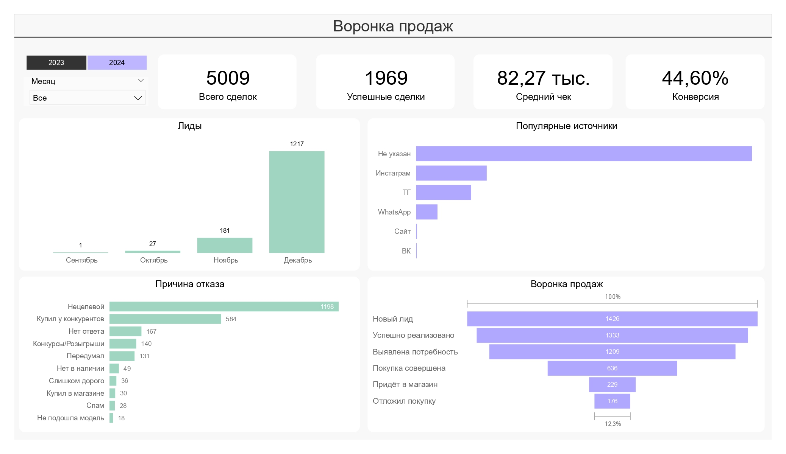
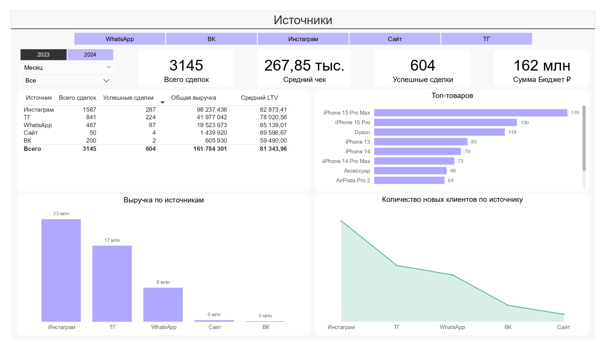
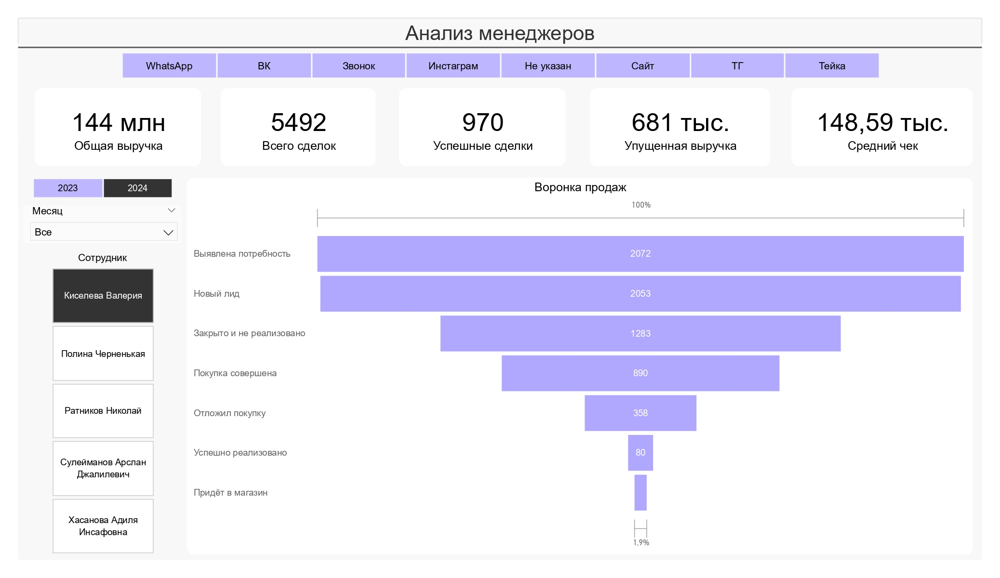
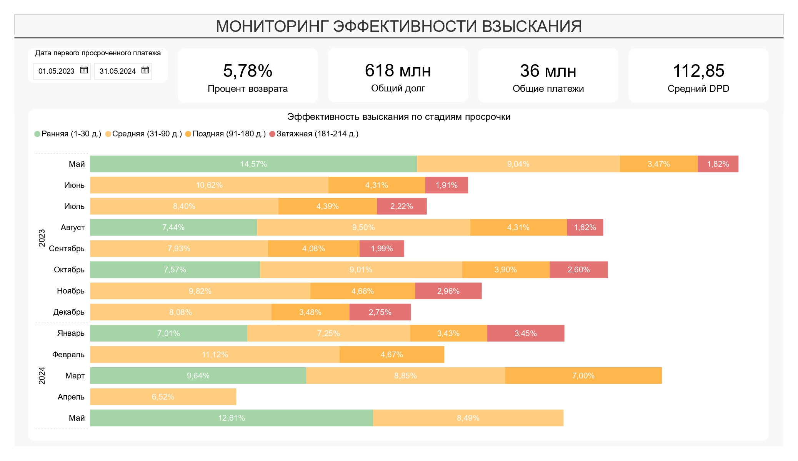
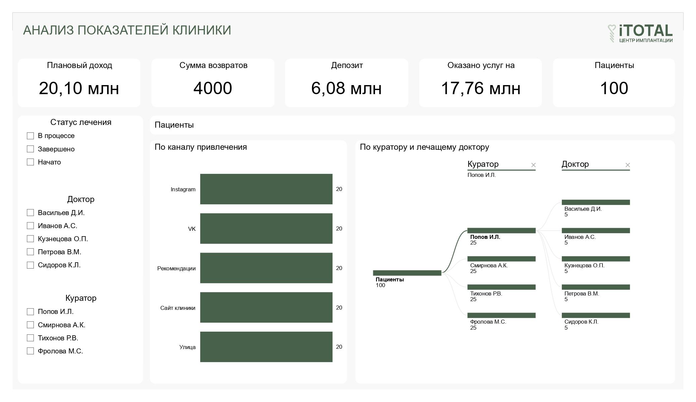
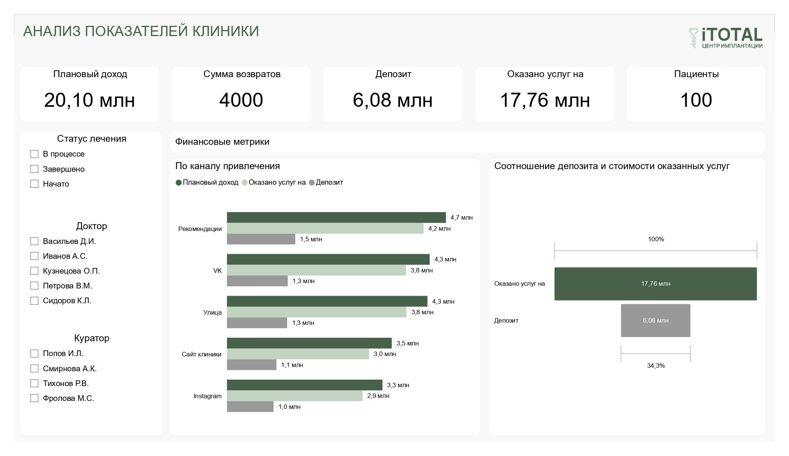

# PBI_Reports

В этом репозитории представлены тестовые аналитические отчёты **Power BI**, демонстрирующие навыки работы с данными, визуализацией и построением дашбордов.

---

## 1. Анализ продаж и воронка клиентов

**Файл отчёта:** [reports/test_1.pbix](reports/test_1.pbix)

**Описание:**  
Отчёт показывает структуру продаж, динамику выручки и конверсию по этапам воронки.  

### Превью отчёта

   
   
   
  

---

## 2. Мониторинг эффективности взыскания

**Файл отчёта:** [reports/test_2.pbix](reports/test_2.pbix)

**Описание:**  
Дашборд для анализа эффективности работы отдела взыскания задолженностей.  

### Превью отчёта

  

---

## 3. Анализ показателей стоматологической клиники

**Файл отчёта:** [reports/test_3.pbix](reports/test_3.pbix)

**Описание:**  
Отчёт демонстрирует ключевые показатели работы стоматологической клиники: посещаемость, выручку и загруженность врачей.  

### Превью отчёта

   
  

